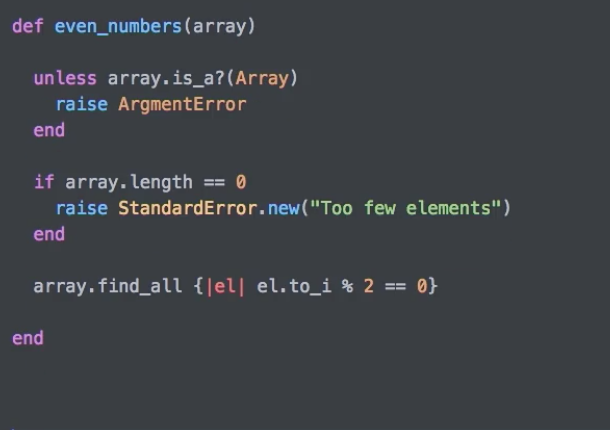

## Ruby

### documentation

`ri String#upcase` ruby information on String -> upcase

### Objects

* everything is Object

* Object have attributes -> object is an instance of Class
* attributes are what make them diffrence
* they have behaviour (mont add mroe if limit is full)
* . method calls a behvaoiur of the object

### variable

* `red = 1` object red with  have value 1
* $ global variable
* @ instance variable
* @@ class variable

### Numerics

* interger `to_i`
* floths `to_f`
* `abs`
* `ceil`
* `floor`
* `round`

### String

* `+` add strind

* `<<` append
* `reverse`
* `capitalize`
* `upaces`
* `downcase`
* `length`
  **string interpolation(JS LITTERALS)**
* escape `"`
* "red car"""s"??? use backslash as escape helper
* ONLY WORKS WITH DOUBLE QUOTES
* `"let\'s"`
* `\n` new line
* `\t` tab
* `"#{var}"`

### Arrays

* defiend in [] brackets,

* can mix object types
* zero index
* apprend end of array `<<`
* **array methods**
* arr.length or x.size,
* x.rverse,
* x.shuffle
* ! -> powerul version of that method
* `x.reverse!` -> reverse and assign.
* `x.uniq` -> uniq items in the array
* `x.compact` -> remove any nills in array
* `x.flatten` -> aray will flattern all array within array are set as sinfle dim
* `x.include?(3)`-> true or false
* `x.delete_at(3)`-> deleted at 3rd index
* or by name `x.delete(Qasim')`
* `y = x.join('~') => "567353~567~56735~2~3~~5673~56~567353~~~Abu~Qasim~4"`
* push pop shift unshift
* add + substract -

### Hashes

* unordetrred collection

* tracked useiong object
* key-value
* **Hash methods**
* looked up by label
* unique hash key
* {}
* specify the index
* comma delimated list of key value pairs
* car = `{'1'=>'2', 'color'=>'red', ...`
* car['1'] -> 2
* car.keys
* car.values
* car.length, car.size
* `x.has_key?('a')`
* has_key?
* hash short hand `x={red:"2", ...`
* Does not work with numbs
* can use integer but not using short hand notaion

### Symbols

* cannot be eeditedw

* begins with colon
* all lowercase
* :car
* better momoenry and cannot be edited
* same item in memory
* doesnt garbnage collect often
* KEY IS ALWAYS SYMBOL

### BOOLENA

* `TRUE

* 
* X.EM

### Ranges

* inclusive range `1..10` 1 to 10
* exclusive range `1...10`` 1 to 9
* .begin -> first
* .end -> last
* inlcude?
* **Trick** array out of range -> `x=[*i]`

### Constants

* All UPPERCASE
* MAX_SCORE = 100
* FIRST letter is contant

### nil

* nothing
* x.nill?
* ! in front means does it have a vlue.

## Control Structure

### if else if

```
if boolean
elsif boolean
else boolen
end
```

### unless

* same as if not -> !

```
unlsss boolen
end
```

### case

* case with boolean

```
case
when boolean
when boolean
else
end
```

* case with compariosn

```
case value
when a
when b
when 1..3
else
end
```

### sortHand

* if else
  `boolean ? resul1 : result2`
  true -> result1
  flaee -> result2

* or operator
  `x=y||z`
  use y or default to zero
`x||=y`
  if x has value x else x = y
`x=y unless x`

### loops

* control method
  * break
  * next
  * redo

```
loop do
break if bool
some calc
end


while until

while bool

end
untill bool
end


loop do
    break if count < 5
    puts "Count donwn #{count}"
    count-=5
end

while count > 5
    puts "Count donwn #{count}"
    count-=5
end

x = 1..10
x= x.to_a
until x.empty?
    f=x.shift
    puts x[2]
   puts "VALUE  #{f.to_s.upcase}"
end

```

### itirators

* perform code on each item

```
  5.times {puts 'hello'}
  1.upto(5) {puts 'hello'}
  3.dwonto(1) {puts 'hello'}
  (1..5).each {puts 'hello'}
  ```

* block var |var|

* Number: times, upto, downto, steps
* Range : each, steps
* String : each_line, each_char, each_byte
* Array : each, each_index, each_with_index
* Hash: each, each_key, each_value, each_pair

## Best Practices

* Sheband line `#!/ur/bin/env ruby` <- tells what to run in

### Exit a running script

* Ctrl + C

* exit, exit!
* abort (msg)

### Input and Output

**output**

* puts has a /n extra line return
* print
**inpout**
* gets input = gets
* `chop` removes last cahr of String
* `chomp` removess last char of a strin if its new line

## Enumerable -> can be counted

* array hash ranges string

* count
* each
* do ----> end
* e.times { }
* Scope -> block var has score

### code block 'do end'

* single line block use {}

-


* once the block finishes the block var finishes with it

### find methods

```ruby
k= 1...100
# find/detect
 k.find {|n| n%5==0}
 => 5
# findall / select
k.select {|n| n%5==0}
 => [5, 10, 15, 20, 25, 30, 35, 40, 45, 50, 55, 60, 65, 70, 75, 80, 85, 90, 95, 100]

# any none all one
 k.any? {|n| n> 100}
 => false
k.none? {|n| n> 100}
 => true

 # delete_if
y=*k
y.delete_if {|n| n%4==0}
 => [1, 2, 3, 5, 6, 7, 9, 10, 11, 13, 14, 15, 17, 18, 19, 21, 22, 23, 25, 26, 27, 29, 30, 31, 33, 34, 35, 37, 38, 39, 41, 42, 43, 45, 46, 47, 49, 50, 51, 53, 54, 55, 57, 58, 59, 61, 62, 63, 65, 66, 67, 69, 70, 71, 73, 74, 75, 77, 78, 79, 81, 82, 83, 85, 86, 87, 89, 90, 91, 93, 94, 95, 97, 98, 99]
```

### Map/collec

* OldArray -> itirateds -> code blaock on them -> add result of the block to new array
* num of item in = num of item out
* map always returns an arry -> use each to chenge to hash
* avoide using puts
* using `!` will change the orignal array

```ruby

z = y.map {|n| n.even? }
 => [false, true, false, true, false, true, false, true, false, true] 
y
 => [1, 2, 3, 4, 5, 6, 7, 8, 9, 10] 
```

### inject/reduce methods

- accumulator
* bloack for using accumulation
* ruby : memo
* itirations cahnges value of memo passed {accumulation}
* result passed
* starting vlaue passed in inject(10)

```ruby
y.inject {|memo, n| memo+'~Qasim~'+n}
 => "a~Qasim~b~Qasim~c~Qasim~d~Qasim~e~Qasim~f~Qasim~g~Qasim~h" 
```

### Sort <=> sapceship operator


* sort tells which way to move items

 ```rb

 k = ["qasim", "red", "vanlue5", "sum", "  n"]
 => ["qasim", "red", "vanlue5", "sum", "  n"]  
 k.sort!
 => ["  n", "qasim", "red", "sum", "vanlue5"] 
 k.sort {|v1,v2| v2.length <=> v1.length}
 => ["vanlue5", "qasim", "  n", "red", "sum"] 
 ```

* sort_by -> sort absed on zize or length
* reutrus an array

### merge methods

- used for hashes
* can merge two hashes together
* rules on meger can be provide

```ruby
k 
 => {:a=>23, :b=>34, :c=>"qasim", "a"=>22, :y=>"qasim\"\nk\nk\n"} 
 y
 => {:a=>"23~Q~", :b=>"34~Q~", :c=>"qasim~Q~", "a"=>"22~Q~", :y=>"qasim\"\nk\nk\n~Q~", 44=>"rr"} 
y.merge(k)
 => {:a=>23, :b=>34, :c=>"qasim", "a"=>22, :y=>"qasim\"\nk\nk\n", 44=>"rr"} 
k.merge(y)
 => {:a=>"23~Q~", :b=>"34~Q~", :c=>"qasim~Q~", "a"=>"22~Q~", :y=>"qasim\"\nk\nk\n~Q~", 44=>"rr"}
```

## Ruby custom methods

- call methods DRY (don't repeat yourself)

### Scope ...

- cant use outsside var inside def block 
  
```rb
a = 10

def abc
 puts a 
end

# a not defined. 

```

- pass values as args or set instance varibale 
- optioal args 


### retun value 
- by defult ruby retursn last vlaue of the operation
  ###  return more than one vlue 
  - reutnr it as an array or ahsh 
 

pig lating 

## ---------------------------
## Ruby Classes !!!1 

## ---------------------------

### Define calsses 
- template of state and behaviour
- attribute -> state 
- methods -> behaviour
 ```rb 
 Calss CamleCaseNAme  

 end 
 ```
- creating instance 
- c = CamleCaseNAme.new 
- c2 = CamleCaseNAme.new 
### attributes 
- values that pesit indi and instance of a class 
- properties of a an object 'car is greeen'
- @instace var it persisits through the instace

### Readed and Writer method
- getter and setter methods
- Ruby 
  ```ruby

  # get_noice 
  def noise
   @noice 
  end
  # set_noise
  def noise = (value)
  @noice = vlue 
  end
  ```

  ### Attribaute methods 
  - atte_*methods
  - - instd of set get we just use Symbols
  - `attr_reader :noice` same as `get_noice` 
  - to get and set we use `attr_acessor` 
  - self! passed through a method 
  ```ruby
    def noise=(value) 
        @noise = value+'33'
    end #value33
    def cranky 
        @noise = 'cra ky'
    end #cra key
    def cranky1 
        self.noise = 'cra-ky'
    end #cra-ky33
  ```

### method acess calls
- restricet acess methods
- public anyone 
- private can only be called from within the calls 
- protected can be called by instance of class and its subclasses 
- helpermethods
```ruby
class ...
methods ..

...

private 
-- alll privaste mehods here 
```
- only allwo acess to methdos when  necessory
### initialize methods
- default methjods whenever an instqace of class is created
- methods `initizlize` get automatically called 

### Challange 
- 
-  

## Class methods
- class specefic behaviours 
-  user `self` for class methods
-  class methods Array.new
-  instance methods Array#size

### class attributes
- properties related to class genrally 
- shared by all instances, as its stored in the class
- calss methods use > class attr uses 
- uses double @ `@@var`

```rb 
class Animal

    attr_accessor :noise, :color, :legs

    # def noise
    #     @noise
    # end

    @currentAnimal = ['some animal']
    @currentTotal = 0
    @@addedAnimal = ['some anumals']
    @@addedTotal = 0

    def initialize(options={})
      @noise, @color, @legs = options[:noise] || "noise",  options[:color] || "color", options[:legs] || " legs"
      @@addedTotal +=1
      @currentTotal = 1
      @@addedAnimal << self

    end

    def self.types 
        @@addedAnimal
    end


    def self.total 
        @@addedTotal 
    end

end

puts ''
a1 = Animal.new 
a2 = Animal.new 
a3 = Animal.new 
a4 = Animal.new 

puts '----------@@addedTypes-------------'
puts Animal.total

### ----------@@addedTypes-------------
### 4
```

### Class Reader Writer methods
- same care createing reader writer for instace var 
- no `attr_accessor` for class methods 

### Radio challange 
```rb 

class Radio
    attr_accessor :volume, :frequency 
    attr_accessor :band

    @@fm_freq = 88.0..108.00
    @@defaultFmFreq = 95.5
    @@am_freq = 540.0..1600.00
    @@defaultAmFreq = 1010.0

    def self.am 
        Radio.new(band: 'AM')
    end

    def self.fm 
        Radio.new(band: 'FM')
    end

    def initialize(options={})
        @band = options[:band] || 'FM'
        @volume = options[:volume] || 5
        @frequency = default_freq
    end


    #  volume setter condtion cannot go below 1 and above 10 
    def volume=(value)
        return if value <1 || value > 10 
        @volume = value 
    end

    def crankUp
        @volume = 11
    end

    def Volstatus 
        "Volume : #{@volume}"
    end

    # Frequency FM 88 to 108 AM 540 to 1600 
    def  frequency=(value)
        return if @band == 'AM' && (value <540 || value > 1600)
        return if @band == 'FM' && (value <88 || value > 108) 
        @frequency = value 
    end


    def status 
        "Freq #{@frequency} --  Ban  #{@band} -- vol  #{@volume}"
    end


private 

    def default_freq 
       @band == 'FM' ? @@defaultFmFreq : @@defaultAmFreq
    end 


end

r1 = Radio.fm
r1.crankUp
r1.volume = 25
r1.frequency = 1000
puts r1.status 

r2 = Radio.am
r2.volume = 25
r2.frequency = 24
puts r2.status
puts r1.Volstatus
puts r2.Volstatus

# Freq 95.5 --  Ban  FM -- vol  11
# Freq 1010.0 --  Ban  AM -- vol  5
# Volume : 11
# Volume : 5
```

## Class inheritance 
- attribute inheritance 
- Animal -> inherit behviours 
` calss subclass < Animal `

-paents must exisit before child inheritds 
- DRY 
- - can inheritt commone set of behaviour 
### oversire and exrtend 
- as kids you can override or add new moehtods 

### Acess super calss from child class 
- call parents mwthods 
  - setup and then call pareent s
  - fall back to emthods ? 
`super` -> CALL THE PARENT 


- proive ars to super 


## DATE and TIME 

- time is in nofsecods since jan 1 1970 
- same as unix time 
- `Time.now` 
- 

### Date class 
- just focus on Dates

### Datetime class -> sub class of date time 
- just focus on Dates

### Date time challange 


## Namespacing 
- conflicts with same Name
- avoide conflicts in naming 

- wrap it in module call it using the module 
- module A -> class Date 
`something = A::Data.new`
- prevent conflics with tuby or somialr class 
- open source code us it mostly 
  
### Mixins
- only one SUPERCLASS  -> only one parent
- module paakage up sahred functionality
- modules are then mixed into class
- DRY
- SHARED FUCNTIONALORTY 
- ADDRESS-> USED BYY person, driver, cusotmer 
- module -> `include moduleName`

### when to use what ? 4


### Load Require and Include 
- Load: loads a source finishes
- Require : smae as load - only one time 
- 
- require - full path 
- - require_relative : laods realitve tot he file 
- include 'includes module in classes' others usee this dierrently 

### challange
- Class ToDoList includeing enumarable module
-  to use enumrables as mixins we must define each metdod
-  

### ECEPTIONS Begin Rescue End 

- we `raise` and Exceptions
- exception bubble up till orignal call
- Handle specific exception using class name 
- `rescue ZeroDivisionErro` put commma to add oanther exception
- Exception methods use hashRocket
- `e.backtrace` -> file, line and where the exception was raised 
- Raise Exception! default Runtime. 
- Raise with errorName `raise ArgumentError`

- Build custom exception class 
  - inherit exception 
    - `class new NewErroe < StandardError`
    - 
```rb 

begin 
resue => e 
puts "#{e.class}, #{e.message}...#{e.backtrace}"
end 

````

## Rails


- first looks up `public`
- 

### creating controller and views

- `rails g <controllrtname> <viewname1> <viewname2>.....`
this will create controlelr for all the views specidied

- controller has action within it for every view 
- within action you could use
- `redirect_to(:controller`

- Link to other pages  `link_to (text, target)`
use @ to declare instace var that are accssibel by all of template 

- contorller acessing prams 
- `@id=params[:id]`
- all params are string 

- CRud actions 
- 

- Rest HTTP 
- 
- to hacve these routes added we use shorty notition 
- delete is not added by default 
- so we use 

- sending email - use mail to `mail_to('aaa@aa.com'` under erb tag

- RESOUES FULL ROUTES HELPER 
- 
- 

FORMS - FORM_FOR HELPER
- 
### Routes

* Simple match route : can use `get qasim/index` or simply `match 'qasim/index', :to => 'qasim#index', :via => :get'` controller#action
* Default route : :controller :action :id `get ':controller(/:action(/:id))'` or `match ':controller(/:action(/:id))', :via=>:get` parenthesis are optional
* root route :  route to root of app `root 'demo#index'`
* resourceful route :


### varibale vs instance variable (@)

* are scoped to that .rb
* to be used on views we use instance variable something like @qasim

### Active record and active relation

* Active record, design pattern understand and interact with data

    ```rb
    user = User.new #user an instance of User table
    user.fn = "Qasim"
    user.save # SQL insert
    ```

* Active relation small queries combined together

  ```rb
    user = user.where(ln:"Qasim")
    users.each{|user|...}


    sub1 = Subject.find(2)
    sub1.update(:name=>"red", :position=>1)

    # Delete and Destroy
    # best to user Destroy
  ```

* Condition methods "where"

#### Rails controller db commands

Take table Peopel

`People.all` list all value sin table people

### Database association

* one to many
* many to many
* many to one

### CRUD

* Controller Plural
* model dealing g with singular

### REST

* transform state
* Subject and pages cna have actions prospered on it
* edit is transformation add is transformation
* using CRUD as transformation
* REST uses GET and POST HTTP verbs
* PATCH update
* DELETE detecting
* **RAILS resource full routes GET POST DELETE PATCH**
  * optimized for REST

  * on `routes.rb`
  * add resource:controller_name to get all the resourseful routes
  * does not come with delete

    ```ruby

        resources :pages do member
        do
        get :delete
        end
    end

    ```

### resourseful url helopers


## Rails 2 Controller and view
