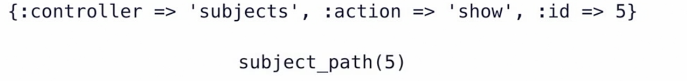

# README

This README would normally document whatever steps are necessary to get the
application up and running.

Things you may want to cover:

* Ruby version

* System dependencies

* Configuration

* Database creation

* Database initialization

* How to run the test suite

* Services (job queues, cache servers, search engines, etc.)

* Deployment instructions

* ...

## **Notes**

### Routes

* Simple match route : can use `get qasim/index` or simply `match 'qasim/index', :to => 'qasim#index', :via => :get'` controller#action
* Default route : :controller :action :id `get ':controller(/:action(/:id))'` or `match ':controller(/:action(/:id))', :via=>:get` parenthesis are optional
* root route :  route to root of app `root 'demo#index'`
* resourceful route :

### varibale vs instance variable (@)

* are scoped to that .rb
* to be used on views we use instance variable something like @qasim

### Active record and active relation

* Active record, design pattern understand and interact with data

    ```rb
    user = User.new #user an instance of User table
    user.fn = "Qasim"
    user.save # SQL insert
    ```
* Active relation small queries combined together
  ```rb
    user = user.where(ln:"Qasim")
    users.each{|user|...}


    sub1 = Subject.find(2)
    sub1.update(:name=>"red", :position=>1)

    # Delete and Destroy 
    # best to user Destroy
  ```
* Condition methods "where"

### Database association

* one to many
* many to many
* many to one

### CRUD

* Controller Plural
* model dealing g with singular

### REST

* transform state
* Subject and pages cna have actions prospered on it
* edit is transformation add is transformation
* using CRUD as transformation
* REST uses GET and POST HTTP verbs
* PATCH update
* DELETE detecting
* **RAILS resource full routes GET POST DELETE PATCH**
  * optimized for REST

  * on `routes.rb`
  * add resource:controller_name to get all the resourseful routes 
  * does not come with delete
  
    ```ruby

        resources :pages do member 
        do 
        get :delete
        end
    end
    
    ```
### resourseful url helopers




